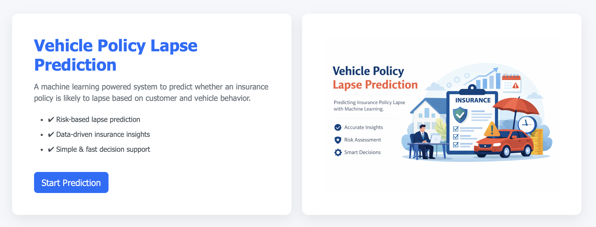

# Vehicle Policy Lapse Prediction

## Overview

Vehicle insurance policy lapses are a critical business challenge for insurers. When a policy lapses, recurring premium revenue stops immediately, and the long term value of the customer is lost. Replacing churned customers is significantly more expensive than retaining existing ones, leading to higher acquisition and operational costs.

This solution focuses on predicting the likelihood of vehicle insurance policy lapses using data-driven methods, enabling insurers to take proactive and targeted actions to reduce churn.

  

## Why Policy Lapse Prediction Matters

* **Protects recurring premium revenue** by identifying at risk policies early
* **Reduces customer acquisition costs** by improving retention
* **Improves portfolio stability** and revenue predictability
* **Enables targeted interventions** for high risk and high value policies
* **Supports better business decision-making** using predictive insights

## Key Business Challenges

* Policy lapses often occur due to missed payments or renewals rather than explicit cancellations, making customer intent difficult to observe.
* Clear lapse indicators typically appear close to renewal dates, leaving limited time for intervention.
* Customer sensitivity to premium changes varies widely and is difficult to estimate in advance.
* Several important lapse drivers (such as financial stress or changes in vehicle usage) are not directly observable in available data.
* The financial impact of lapses is uneven, with certain policies contributing disproportionately to revenue loss.

## Solution Approach

The solution uses historical policy and customer data to estimate the probability of a policy lapsing. The predictive output can be integrated into business workflows to:

* Identify policies at high risk of lapse
* Prioritize retention efforts
* Support proactive customer engagement strategies

The approach is designed to be scalable, interpretable, and aligned with real world business needs.

## Current Capabilities

* End to end data processing and feature engineering
* Predictive model for policy lapse risk
* Probability based risk scoring
* Simple web interface for generating predictions
* Structured logging and error handling

## Planned Enhancements

- [x] Dockerize the application for consistent builds and deployments
- [ ] Set up CI/CD pipelines for automated testing and deployment to Azure
- [ ] Integrate MLflow for experiment tracking and model versioning
- [ ] Use DVC for data and model version control
- [ ] Add basic model monitoring to track performance and data drift
- [] Integrate an LLM layer to convert model predictions into actionable business decisions, customer communication, and retention strategies

## Summary

This project provides a practical and business focused foundation for predicting vehicle insurance policy lapses. By combining predictive analytics with operational insights, it helps insurers reduce churn, protect revenue, and improve customer retention strategies.

---

#### Acknowledgement

- ChatGPT was used as a development assistant for drafting UI templates, Flask application structure, and implementation ideas. All model development, design choices, and final integrations were reviewed, adapted, and validated as part of this project.

- This project was built as part of learning from the following end to end machine learning project:
[End to End Machine Learning Project](https://github.com/krishnaik06/mlproject)

> **Note:** > **Note:** This project is part of an ongoing learning process and is continuously evolving.