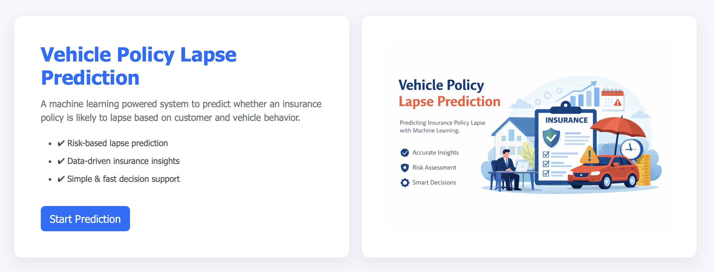

# Vehicle Insurance Policy Lapse Prediction

End-to-end machine learning system for predicting vehicle insurance policy lapse risk and supporting proactive customer retention strategies.

<p align="center">
  
</p>

## Overview

This project predicts the likelihood of vehicle insurance policy lapse (non-renewal) using historical vehicle insurance policy data.

The primary objective is to help insurers identify customers with high lapse risk early and support proactive retention strategies before policy renewal.

The project covers the complete machine learning lifecycle, including:
- Exploratory Data Analysis (EDA)
- Feature Engineering
- Data Preprocessing
- Imbalanced Classification Modeling
- Threshold Optimization
- Model Interpretation
- MLflow Experiment Tracking
- API Development
- Containerized Deployment

The dataset contains approximately 23,000 insurance policies with moderate class imbalance, where lapse cases represent roughly 13% of the dataset.


## Key Highlights

- End-to-end machine learning workflow
- Domain-driven feature engineering
- Recall-focused imbalanced classification
- Logistic Regression model interpretation
- Threshold optimization for retention targeting
- MLflow experiment tracking
- FastAPI prediction service
- Flask-based web interface
- Dockerized deployment on Azure


## Feature Engineering

Feature engineering focused on improving model stability, reducing sparsity, and creating more interpretable customer risk representations for Logistic Regression.

Key feature engineering steps included:
- grouping sparse categorical variables
- reducing multicollinearity among premium features
- simplifying unstable high-cardinality categories
- creating stable risk-based customer groupings

Several categorical variables contained very small groups that produced unstable coefficients during modeling. These categories were consolidated into broader risk-based representations to improve generalization and interpretability.

Correlation analysis also revealed strong multicollinearity among premium-related variables. Highly correlated premium features were removed to improve model stability and reduce redundancy.


## Modeling Approach

The following models were evaluated:
- Logistic Regression (Balanced)
- Random Forest (Balanced)
- XGBoost
- CatBoost

Although tree-based models achieved higher overall accuracy, they produced extremely low recall for the minority lapse class and failed to effectively identify lapse customers.

Logistic Regression consistently provided:
- stronger minority-class detection
- more stable recall performance
- better interpretability
- clearer business explainability

The final model was a Logistic Regression model trained using:
- balanced class weighting
- engineered categorical groupings
- reduced multicollinearity
- threshold optimization

This approach provided the best balance for a recall-focused insurance retention strategy.


## Final Model Performance

### Default Threshold (0.50)

| Metric | Score |
|---|---|
| Accuracy | 0.5848 |
| Precision | 0.1690 |
| Recall | 0.5719 |
| F1-Score | 0.2609 |
| ROC-AUC | 0.6049 |

### Optimized Threshold (0.45)

| Metric | Score |
|---|---|
| Accuracy | 0.4707 |
| Precision | 0.1592 |
| Recall | 0.7310 |
| F1-Score | 0.2614 |
| ROC-AUC | 0.6049 |

Threshold optimization significantly improved recall, increasing the model’s ability to identify potential lapse customers.

Although precision and overall accuracy decreased due to additional false positives, this tradeoff is appropriate in a recall-focused insurance retention setting, where missing real lapse customers is often more costly than targeting additional low-risk customers.


## Model Interpretation

Logistic Regression coefficient analysis identified several meaningful drivers of lapse behavior, including:
- worsening bonus/malus evolution
- yearly payment frequency
- regional variation
- vehicle-related risk characteristics

Features associated with stronger retention behavior included:
- improving bonus/malus evolution
- installment payment frequency
- stable customer regions

These results demonstrate that customer behavior, payment structure, and regional risk patterns contribute meaningfully to lapse prediction.


## Azure AutoML Reference

Azure AutoML experimentation was explored for benchmarking purposes.

While AutoML ensemble pipelines achieved slightly stronger ranking performance, the manually developed Logistic Regression model provided:
- stronger minority-class detection
- better interpretability
- simpler deployment architecture
- clearer business reasoning

for the current project scope.


## System Architecture

```text
training/
├── notebooks/
├── preprocessing/
├── model_training/

artifacts/
├── model/
│   └── modelv2.pkl

model-service/
├── FastAPI prediction service

api-gateway/
├── Flask web interface
```